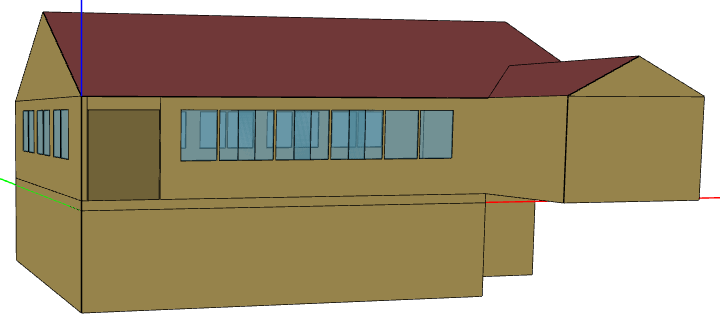
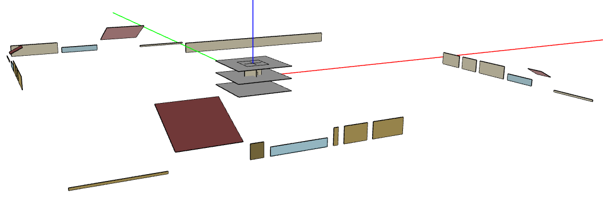

Introduction
============

OpenStudio-HPXML allows running residential EnergyPlus simulations using an `HPXML file <https://hpxml.nrel.gov/>`_ for the building description.
It is intended to be used by user interfaces or other automated software workflows that automatically produce the HPXML file.
A `Schematron <http://schematron.com/>`_ document for the EnergyPlus use case is used to validate that the appropriate HPXML inputs are provided to run EnergyPlus.

Capabilities
------------

OpenStudio-HPXML capabilities include:

- Modeling individual dwelling units or whole multifamily buildings; see :ref:`hpxmlbuilding` for more information
- Modeling a wide range of building technologies
- HVAC design load calculations and equipment autosizing
- Occupancy schedules (smooth or stochastic)
- Utility bill calculations (flat, tiered, time-of-use, real-time pricing, etc.)
- Emissions calculations (CO2e, etc.)
- Annual and timeseries outputs (energy, loads, temperatures, etc.)
- Optional HPXML inputs with transparent defaults
- Schematron and XSD Schema input validation

Accuracy vs Speed
-----------------

The EnergyPlus simulation engine is like a Swiss army knife.
There are often multiple models available for the same building technology with varying trade-offs between accuracy and speed.
This workflow standardizes the use of EnergyPlus (e.g., the choice of models appropriate for residential buildings) to provide a fast and easy to use solution.

The workflow is continuously being evaluated for ways to reduce runtime without significant impact on accuracy.
End-to-end simulations typically run in 3-10 seconds, depending on complexity, computer platform and speed, etc.

There are additional ways that software developers using this workflow can reduce runtime:

- Run on Linux/Mac platform, which is significantly faster than Windows.
- Run on computing environments with 1) fast CPUs, 2) sufficient memory, and 3) enough processors to allow all simulations to run in parallel.
- Limit requests for timeseries output (e.g., ``--hourly``, ``--daily``, ``--timestep`` arguments) and limit the number of output variables requested.
- Avoid using the ``--add-component-loads`` argument if heating/cooling component loads are not of interest.
- Use the ``--skip-validation`` argument if the HPXML input file has already been validated against the Schema & Schematron documents.

.. _openstudio_measures:

OpenStudio Measures
-------------------

You can read about OpenStudio measures `here <http://nrel.github.io/OpenStudio-user-documentation/getting_started/about_measures/>`_.
The OpenStudio measures used by the workflow are:

#. ``BuildResidentialHPXML``: A measure that generates an HPXML file from a set of building description inputs (including, e.g., simplified geometry inputs).
#. ``BuildResidentialScheduleFile``: A measure that generates a CSV of detailed schedules (e.g., stochastic occupancy) for use in the simulation.
#. ``HPXMLtoOpenStudio``: A measure that translates an HPXML file to an OpenStudio model.
#. ``ReportSimulationOutput``: A reporting measure that generates a variety of simulation-based annual/timeseries outputs in CSV/JSON/MessagePack format.
#. ``ReportUtilityBills``: A reporting measure that generates utility bill outputs in CSV/JSON/MessagePack format.

Geometry
--------

The surfaces stored in HPXML building description files represent the area and orientation of ground and exterior exposure, but do not represent their position relative to each other.
See :ref:`enclosure` for more information.

The ``BuildResidentialHPXML`` measure generates enclosure elements of an HPXML file using the following steps:

#. Collect a set of simplified geometry inputs (e.g., conditioned floor area, number of floors above grade, aspect ratio, garage width).
#. Use the inputs and methods from a `geometry resource file <https://github.com/NREL/OpenStudio-HPXML/blob/master/BuildResidentialHPXML/resources/geometry.rb>`_ to create 3D closed-form dwelling unit representations in OpenStudio.
#. Map individual OpenStudio surfaces to HPXML elements using surface types, outside boundary conditions, areas, orientations, etc.

The image below is an example 3D representation for a single-family detached dwelling unit.
Some of the simplified geometry inputs used to assemble the model are given below:

- conditioned basement foundation type
- rim joists with a height of 9.25 in
- 1 living floor above grade
- unvented attic w/gable roof and 6:12 pitch
- 50% protruding 12 ft wide garage
- windows on all 4 facades
- 40 ft2 front door oriented to the South

Each of the surfaces (i.e., walls, floors, ceilings, roof decks, windows, doors, etc.) is mapped to an enclosure-related element as described in :ref:`enclosure`.
Like surfaces (i.e., by type, orientation, exposure, etc.) are collapsed into a single surface with aggregate surface area.
This can help to improve the speed of the simulation.

The ``HPXMLtoOpenStudio`` measure translates :ref:`enclosure` elements (back) to OpenStudio Model.
The image below shows the result of translating the previous single-family detached example, stored in an HPXML file, to OpenStudio Model.
Note that all surfaces retain their original area and orientation, and are organized such that they do not shade one another.

The geometry representation in this OpenStudio Model is simulated using EnergyPlus.

In the case of whole multifamily buildings, the process is much the same.
Individual dwelling units contained in the HPXML file are translated, and resulting OpenStudio Models are merged into a single OpenStudio Model.
Sets of dwelling unit surfaces are spaced along the y-axis so as not to sit on top of one another.

License
-------

This project is available under a BSD-3-like license, which is a free, open-source, and permissive license. For more information, check out the `license file <https://github.com/NREL/OpenStudio-HPXML/blob/master/LICENSE.md>`_.
