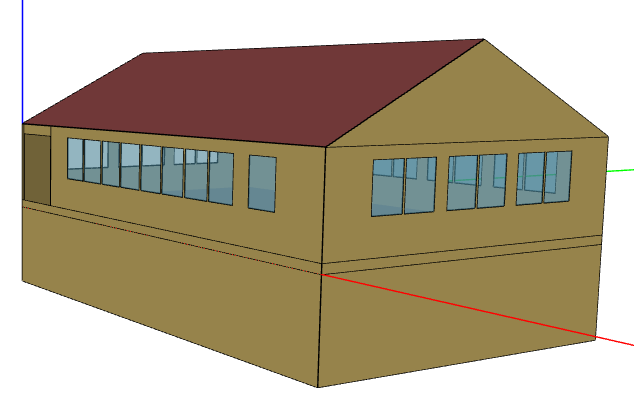
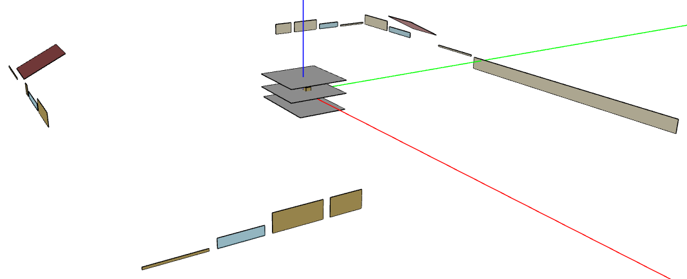
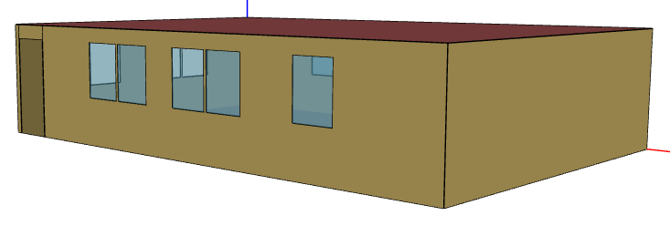
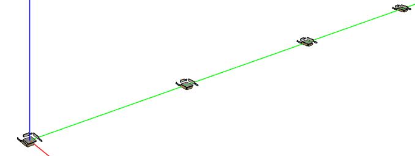

Introduction
============

The OpenStudio-HPXML repository consists of a simple residential EnergyPlus-based workflow build on top of `OpenStudio measures <http://nrel.github.io/OpenStudio-user-documentation/getting_started/about_measures/>`_.
The workflow operates using `HPXML building description files <https://hpxml.nrel.gov>`_.

The OpenStudio measures used by the workflow are:

#. ``BuildResidentialHPXML``: A measure that generates an HPXML file from a set of building description inputs (including, e.g., simplified geometry inputs).
#. ``BuildResidentialScheduleFile``: A measure that generates a CSV of detailed schedules (e.g., stochastic occupancy) for use in the simulation.
#. ``HPXMLtoOpenStudio``: A measure that translates an HPXML file to an OpenStudio model.
#. ``ReportSimulationOutput``: A reporting measure that generates a variety of simulation-based annual/timeseries outputs in CSV/JSON/MessagePack format.
#. ``ReportUtilityBills``: A reporting measure that generates utility bill outputs in CSV/JSON/MessagePack format.

Building Type Scope
-------------------

See :ref:`hpxmlbuilding` for information on the types of buildings/simulations that OpenStudio-HPXML supports.

Accuracy vs Speed
-----------------

The EnergyPlus simulation engine is like a Swiss army knife.
There are often multiple models available for the same building technology with varying trade-offs between accuracy and speed.
This workflow standardizes the use of EnergyPlus (e.g., the choice of models appropriate for residential buildings) to provide a fast and easy to use solution.

The workflow is continuously being evaluated for ways to reduce runtime without significant impact on accuracy.
End-to-end simulations typically run in 3-10 seconds, depending on complexity, computer platform and speed, etc.

There are additional ways that software developers using this workflow can reduce runtime:

- Run on Linux/Mac platform, which is significantly faster than Windows.
- Run on computing environments with 1) fast CPUs, 2) sufficient memory, and 3) enough processors to allow all simulations to run in parallel.
- Limit requests for timeseries output (e.g., ``--hourly``, ``--daily``, ``--timestep`` arguments) and limit the number of output variables requested.
- Avoid using the ``--add-component-loads`` argument if heating/cooling component loads are not of interest.
- Use the ``--skip-validation`` argument if the HPXML input file has already been validated against the Schema & Schematron documents.

Geometry
--------

The surfaces stored in HPXML building description files represent the area and orientation of ground and exterior exposure, but do not represent their position relative to each other.
See :ref:`enclosure` for more information.

The ``BuildResidentialHPXML`` measure generates enclosure elements of an HPXML file using the following steps:

#. Collecting a set of simplified geometry inputs (e.g., conditioned floor area, number of floors above grade, aspect ratio, garage width).
#. Using the inputs and methods from a `geometry resource file <https://github.com/NREL/OpenStudio-HPXML/blob/master/BuildResidentialHPXML/resources/geometry.rb>`_ to create 3D closed-form dwelling unit representations in OpenStudio.
#. Mapping individual OpenStudio surfaces to HPXML elements using surface types, outside boundary conditions, areas, orientations, etc.

The ``HPXMLtoOpenStudio`` measure translates enclosure elements of an HPXML file back to OpenStudio Model.
OpenStudio surfaces are organized such that they do not shade each other.

single-family detached

apartment unit

License
-------

This project is available under a BSD-3-like license, which is a free, open-source, and permissive license. For more information, check out the `license file <https://github.com/NREL/OpenStudio-HPXML/blob/master/LICENSE.md>`_.
